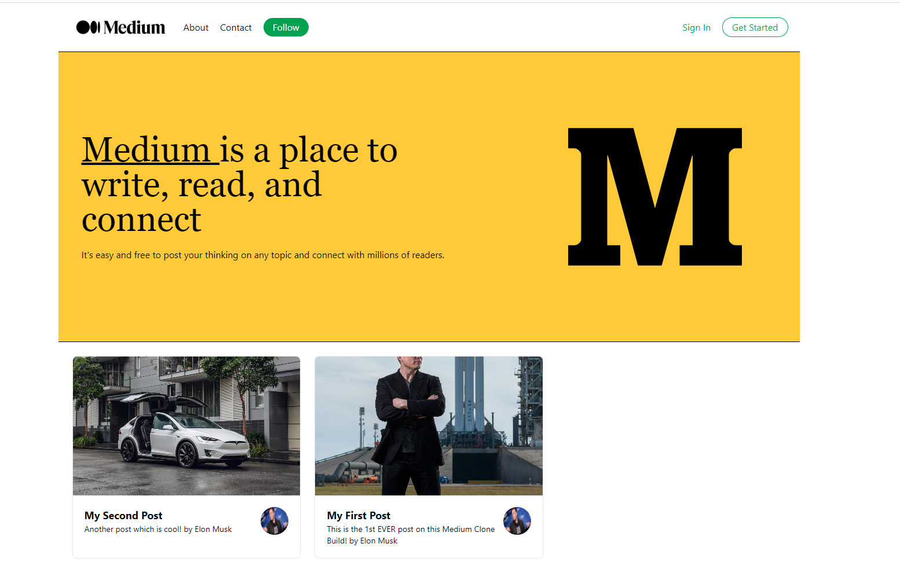

# Omnifood

Medium clone is a project that replicates the infamous medium website. The project used sanity, as a CMS management platform to manage the articles/comments by users before being deployed on the website.

This project was created using HTML, CSS, React, NextJS, Tailwind, Sanity.

## Screenshots

## Demo

https://medium-clone-dun.vercel.app/

